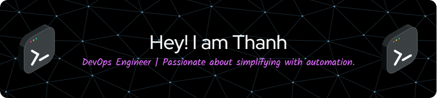

---

🌟 Experienced IT Professional Specializing in Cloud, Virtualization, and Data Center Solutions

Welcome to my GitHub profile! I'm a DevOps Engineer with a strong foundation in infrastructure, cloud, and automation. I'm passionate about evolving my skills in cloud-native and automation technologies and am excited by opportunities where I can contribute to strategic growth and innovation in cloud and DevOps practices. Explore my projects to see my work in cloud, containerization, CI/CD, and more!

---

### 🔧 Technologies and Tools

With over a decade in IT, I have a robust background in designing, implementing, and managing data center and cloud environments across a wide range of platforms and technologies. My expertise spans server infrastructure, storage, virtualization, backup, disaster recovery, and cloud computing solutions, with deep technical skills in VMware and Private Cloud. I am currently leading a R&D team at IIJ Global Solutions, where we focus on building and maintaining high-availability cloud platforms, enabling seamless scalability and security for our clients.

- **Cloud**: AWS, VMware Cloud Director
- **Virtualization**: VMware, KVM, Virtuozzo, Proxmox
- **Containerization**: Docker, Kubernetes
- **CI/CD**: GitLab CI/CD, GitHub Actions
- **Configuration Management**: Ansible, Terraform
- **Monitoring**: Prometheus, Grafana, ELK Stack
- **Scripting**: Bash, Python
- **Version Control**: Git, GitHub
- **Backup & DR Services**: Veeam, Acronis, vCloud Director Availability 
- **Infrastructure & Servers**: Software Defined Data Center,  VMware Horizon (VDI), Dell, HP, Storage Solutions, SAN, Virtual SAN, NAS.

### 🌱 I'm currently learning

- Learning Golang to enhance automation tasks and support microservices on Kubernetes
- Continuously building expertise in cloud-native and DevOps tools

### 👯 I'm looking to collaborate on

- Seeking roles that allow for advancement in cloud computing, software defined data center infrastructure, automation, and infrastructure as code, with a chance to impact large-scale IT projects and mentor upcoming IT professionals.

---

### 📫 How to reach me

